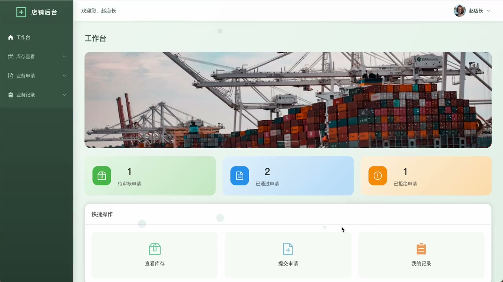
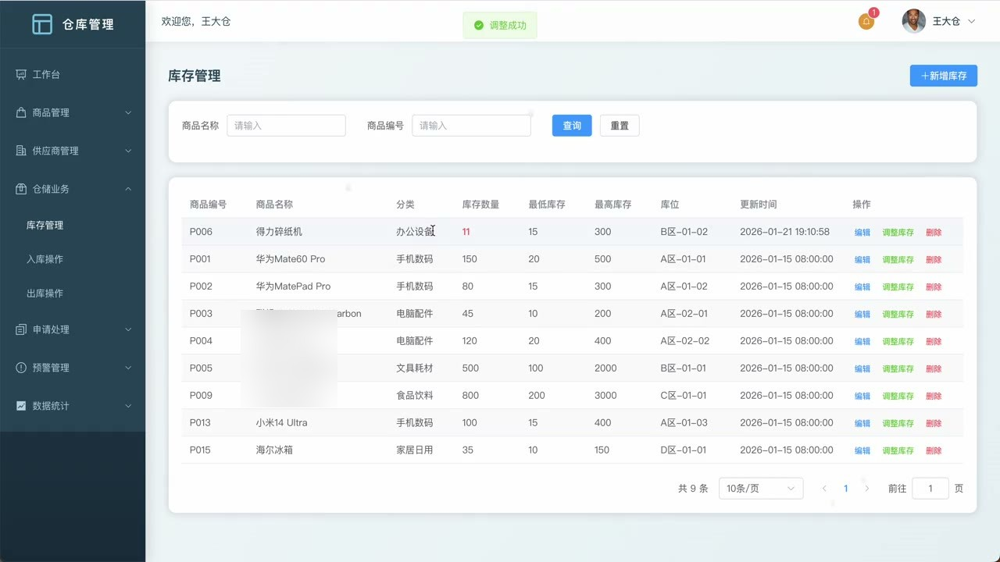
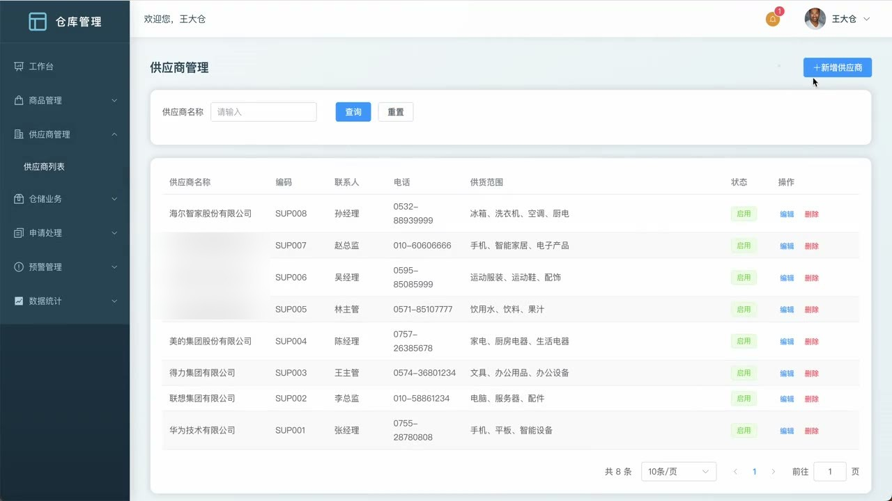
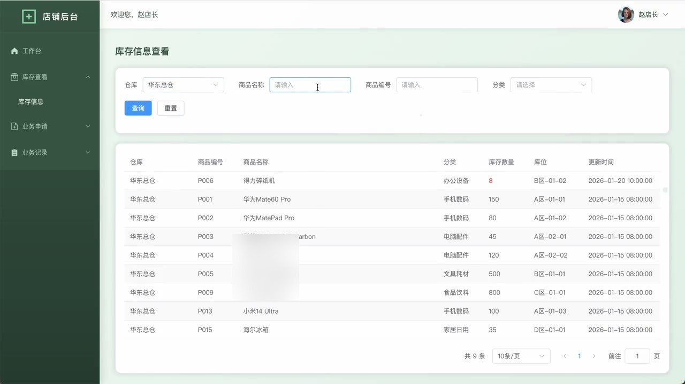
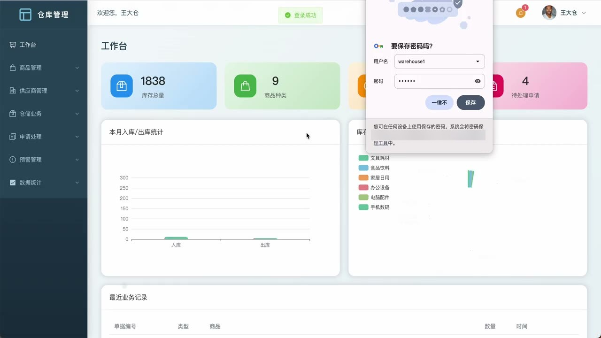
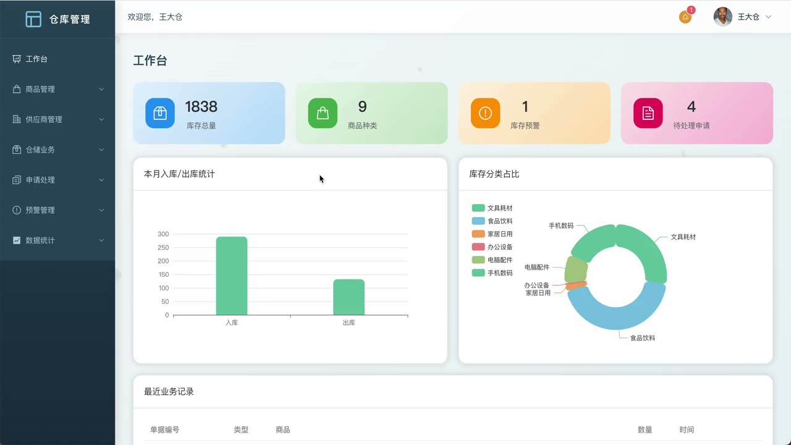

# (附文档)Springboot3+Vue3+MySQL 仓库管理系统

**技术栈**：Springboot3、Vue3、MySQL

### 系统简介

本系统基于 Spring Boot 3 + Vue 3 前后端分离架构，提供多仓库、多角色的库存管理解决方案。系统内置管理员、仓库操作员两种角色，支持商品管理、库存盘点、入库出库操作、调拨申请与审批、供应商管理、库存预警及数据统计看板，适用于中小型企业的仓库数字化管理。
 
### 核心功能
 
### 管理员端

 
- 用户管理：查看用户列表（支持按用户名/真实姓名/角色/状态筛选），新增/编辑/删除用户，修改用户状态（启用/禁用） 
- 仓库管理：查看仓库分页列表（支持按名称/编码/状态筛选），新增/编辑/删除仓库，维护仓库地址、负责人、容量等信息 
- 商品管理：查看商品分页列表（支持按商品编号/名称/分类/供应商/状态筛选），新增/编辑/删除商品，维护商品规格、单位、价格及关联分类与供应商 
- 商品分类管理：查看分类分页列表（支持按名称/状态筛选），新增/编辑/删除分类，支持二级分类（parentId），维护分类编码、排序及图标 
- 供应商管理：查看供应商分页列表（支持按名称/编码/状态筛选），新增/编辑/删除供应商，维护联系人、电话、邮箱、地址、供应范围及银行账户 
- 轮播图管理：查看轮播图分页列表（支持按类型/状态筛选），新增/编辑/删除轮播图，设置排序、类型、链接及启用状态 
- 库存管理：查看所有仓库库存分页列表（支持按仓库/商品编码/名称/分类筛选），查看库存详情，手动调整库存数量 
- 库存预警：查看库存低于最低预警线的商品列表（支持按仓库筛选），统计各仓库预警总数 
- 库存补充：快速补充指定库存记录的库存量（输入增加数量） 
- 入库操作：选择仓库、商品、数量及供应商，生成入库记录并自动更新库存数量 
- 出库操作：选择仓库、商品、数量，校验库存充足后生成出库记录并扣减库存 
- 调拨申请审批：查看调拨/出库申请列表（支持按类型/来源仓库/商品名称/状态/申请人筛选），审批通过或驳回申请，通过后自动执行出库或调拨（调拨含出库+入库） 
- 库存记录查询：查看所有入库/出库记录分页列表（支持按仓库/类型/商品编码/名称筛选），查看记录详情（记录编号、操作前后数量、操作人） 
- 数据统计：查看库存总览统计（总库存量、商品种类数、低库存数量），查看按分类的库存分布统计，查看月度入库/出库统计及近6个月趋势图表数据
 
### 仓库操作员端

 
- 登录/注册：使用用户名密码登录（按角色区分），支持新账号注册 
- 个人信息管理：修改个人基本信息（真实姓名、电话、邮箱、头像），修改登录密码 
- 本仓库存查看：查看所属仓库的库存分页列表（支持按商品编码/名称/分类筛选），查看库存详情 
- 库存预警：查看本仓库库存低于预警线的商品列表，查看本仓库预警总数 
- 库存补充：对本仓库库存进行快速补充（输入增加数量） 
- 入库操作：对本仓库选择商品进行入库，填写数量、供应商及备注，自动更新库存并生成入库记录 
- 出库操作：对本仓库选择商品进行出库，填写数量及备注，校验库存后自动扣减并生成出库记录 
- 调拨申请：提交调拨申请（选择目标仓库、商品、数量、原因），或提交出库申请（仅出库不调入） 
- 我的申请：查看本人提交的所有调拨/出库申请列表，查看各状态（待审批/已通过/已驳回）的申请数量 
- 库存记录查询：查看本仓库的入库/出库记录分页列表（支持按类型/商品编码/名称筛选） 
- 数据统计：查看本仓库的库存总览、分类分布统计、月度统计及近6个月趋势 
- 轮播图查看：查看已启用的轮播图列表（按类型筛选）
 
### 技术栈

 后端框架Spring Boot 3 ORMMyBatis-Plus 权限角色字段（admin/warehouse）校验 前端框架Vue 3 状态管理Pinia 构建工具Vite 数据库MySQL HTTP 客户端Axios 工具库Hutool 文件上传Spring MultipartFile
 
### 交付内容

 
- 后端完整源码 
- 前端完整源码 
- 数据库初始化脚本 
- 万字文档

## 界面展示

---

## 获取完整源码 + 万字文档

本仓库为项目介绍页。**完整前后端源码、数据库初始化脚本、万字项目文档**，请加微信 `kangkangcode`，或访问 [codekk.top](http://codekk.top) 获取。

可作课程设计 / 毕业设计参考，支持远程部署调试。